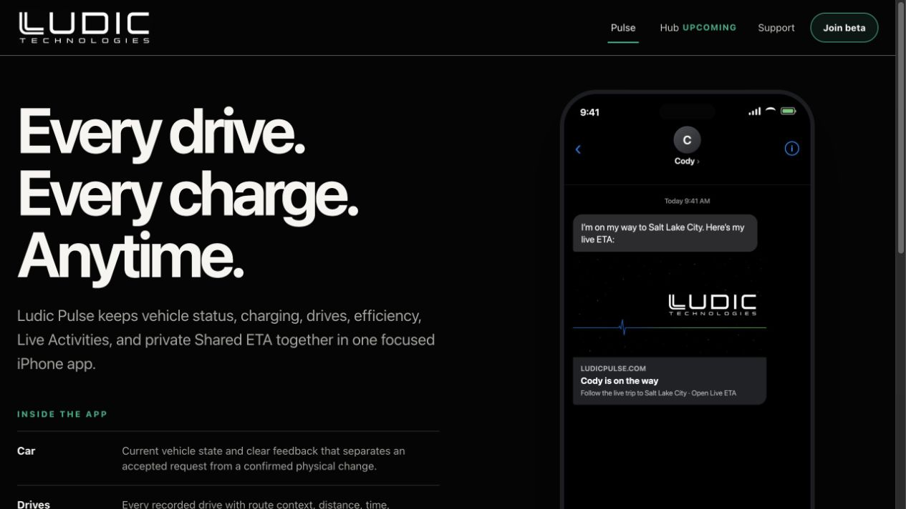
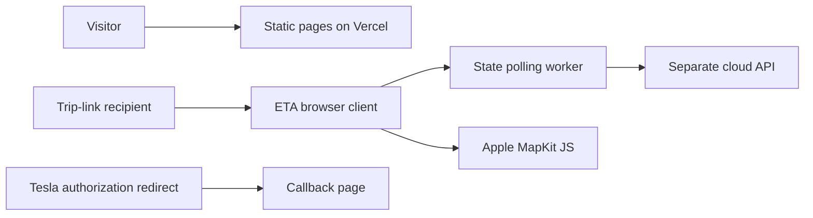

# Ludic Pulse Web

The public web surface for Ludic Pulse, a Tesla companion app: product pages, private-beta signup, support, Tesla account-linking callback, and a Shared ETA recipient experience that opens in a browser without an app install.

**[Visit Ludic Pulse](https://ludicpulse.com)** · **[Shared ETA engineering case study](docs/SHARED_ETA_CASE_STUDY.md)**



*Public website captured September 22, 2026. App screenshots are the existing website's product showcase.*

## Repository scope

This repository contains the static website and browser clients. The iPhone app and cloud API are maintained separately and are not included here. The website invites users to a private beta; its availability does not establish a public App Store release or verify physical vehicle behavior.

## A quick review

1. **See the public product surface:** open [the website](https://ludicpulse.com). The marketing pages are available without connecting a Tesla account.
2. **Review the integration:** read [the Shared ETA case study](docs/SHARED_ETA_CASE_STUDY.md), then follow [the browser client](eta/app.js) and [polling worker](eta/state-worker.js).
3. **Inspect failure behavior:** start with [map-model tests](eta/map-model.test.js) and [worker tests](eta/state-worker.test.js). A live ETA demonstration requires a valid private sharing link; the public code and tests can be reviewed without one.

## Engineering highlights

- **No-install trip sharing:** the [`eta/`](eta/) client displays arrival context and a map for a valid, time-limited sharing link.
- **Token lifecycle:** the page removes the bearer token from the URL before creating the polling worker or loading MapKit. The worker owns the bearer for subsequent state requests.
- **Explicit map provenance:** Tesla route geometry is preferred when valid; Apple-generated routes are labeled as estimates, and unusable routes have fallback behavior.
- **Separate public and sensitive flows:** anonymous page-view analytics are included on marketing pages and omitted from the ETA and Tesla callback pages.
- **Behavioral tests:** the test suite covers token handling, worker failures, map fallbacks, stale responses, page content, and selected accessibility properties.

The [case study](docs/SHARED_ETA_CASE_STUDY.md) connects these choices to constraints and tests rather than relying on broad “production-grade” claims.

## Architecture



**Stack:** HTML, CSS, JavaScript, Web Workers, Apple MapKit JS, Vercel routing/headers, Node's built-in test runner. No frontend build step.

## Source map

| Path | Purpose |
| --- | --- |
| [`index.html`](index.html), [`pulse/`](pulse/), [`hub/`](hub/) | Product pages |
| [`beta/`](beta/) | Beta signup and confirmation |
| [`eta/app.js`](eta/app.js) | Recipient UI, token handoff, and map lifecycle |
| [`eta/state-worker.js`](eta/state-worker.js) | Token ownership and state polling |
| [`eta/map-model.js`](eta/map-model.js) | Route validation and selection |
| [`auth/tesla/`](auth/tesla/) | Account-linking callback |
| [`support/`](support/), [`privacy/`](privacy/), [`terms/`](terms/) | Support and policy pages |
| [`vercel.json`](vercel.json) | Routing and response headers |
| [`tests/`](tests/) and [`eta/*.test.js`](eta/) | Site and Shared ETA tests |

## Run locally

```bash
python3 -m http.server 8000
```

Open `http://localhost:8000`. Marketing pages can be inspected locally; a live trip requires a valid sharing token and the separately configured API/MapKit services.

Run the test suite with a current Node LTS:

```bash
node --test tests/*.test.mjs eta/*.test.js
```

**Verification snapshot, September 22, 2026:** 77 tests passed on the source used for this documentation update. These include mocked browser/MapKit tests and source-level checks, not an end-to-end live-car test or a complete accessibility certification.

## Deployment and boundaries

Vercel serves the authored files and applies the routing and response-header policy in `vercel.json`. A plain local static server does not reproduce those headers. The API enforces server-side trip access and expiry; client token handling is one part of that boundary.

## Project context

Part of Cody Ostler's Ludic Pulse work, developed with AI coding assistance. This public repository provides inspectable browser integration and testing examples while keeping the separate app and service implementations private.
